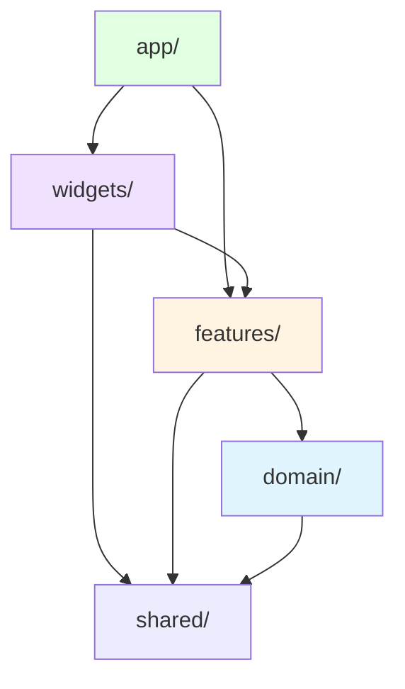

# Finsight — Architecture Documentation

## Архитектурные принципы

### 1. Полностью фронтенд-only проект

**Критически важно:** В этом проекте НЕТ серверных эндпоинтов.

- ❌ Нет Next.js API Routes
- ❌ Нет серверного кода кроме RSC
- ❌ Нет бэкенда в классическом понимании
- ✅ Firebase Auth + Firestore + Security Rules = "бэкенд"
- ✅ Все вычисления на клиенте
- ✅ Real-time подписки через Firestore SDK

**Почему так:**
- Это демо-проект для портфолио → простота важнее масштаба
- Firestore Security Rules заменяют API layer
- Инсайты пересчитываются мгновенно с optimistic updates
- Бесплатный tier Firestore покрывает MVP

---

### 2. Feature-Sliced Design (FSD)

Проект структурирован по FSD методологии:

```
Layers (сверху вниз по зависимостям):
app → pages → widgets → features → entities → shared

domain/ — отдельный слой для бизнес-логики (не часть FSD)
```

**Правила импортов:**
- Слой может импортировать только из слоёв НИЖЕ себя
- features/ НЕ импортируют друг из друга
- domain/ не знает о React, Firebase, UI

---

### 3. State Management Strategy

| Тип состояния | Инструмент | Правило |
|---|---|---|
| Server state | React Query | единственный source of truth для Firestore данных |
| Client UI state | Zustand | ТОЛЬКО UI (modals, tabs), НИКОГДА не server data |
| URL state | nuqs | фильтры, пагинация, выбранный период |
| Form state | React Hook Form + Zod | валидация на клиенте |
| Auth state | Firebase Auth | `onAuthStateChanged` → React Query invalidate |
| Computed state | useMemo | инсайты, агрегаты, прогноз |

**КРИТИЧЕСКИЙ ИНВАРИАНТ:**
```typescript
// ❌ НИКОГДА не делай так:
const [transactions, setTransactions] = useState([])
useEffect(() => {
  TransactionService.list().then(setTransactions)
}, [])

// ✅ Только через React Query:
const { data: transactions } = useQuery({
  queryKey: queryKeys.transactions.all(userId),
  queryFn: () => TransactionService.list(userId),
})
```

---

### 4. Rendering Strategies

| Страница | Стратегия | Причина |
|---|---|---|
| `/login` | CSR | OAuth popup, нет SEO потребности |
| `/dashboard` | SSR | персональные данные, быстрый FCP |
| `/transactions` | SSR | фильтры в URL, user-specific |
| `/settings` | SSR | user-specific конфиг |

**Charts rendering:**
```typescript
// Recharts ВСЕГДА через dynamic import с ssr: false
const BarChart = dynamic(() => import('./BarChart'), { ssr: false })
```

---

## Структура проекта

```
src/
├── app/                          # Next.js App Router
│   ├── login/
│   │   └── page.tsx             # CSR — OAuth popup
│   ├── (dashboard)/             # Route group с layout
│   │   ├── layout.tsx           # Общий layout для авторизованных
│   │   ├── page.tsx             # Dashboard
│   │   ├── transactions/
│   │   │   └── page.tsx         # SSR — фильтры в URL
│   │   └── settings/
│   │       └── page.tsx         # SSR — категории + правила
│   └── middleware.ts            # Protected routes redirect
│
├── domain/                       # Бизнес-логика (чистый слой)
│   ├── transaction/
│   │   ├── Transaction.ts       # Zod схема + TypeScript тип
│   │   └── TransactionService.ts # CRUD через Firestore SDK
│   ├── category/
│   │   ├── CategoryService.ts
│   │   └── defaults.ts          # Дефолтные категории при регистрации
│   ├── rule/
│   │   └── CategorizationEngine.ts # Чистые функции, применение правил
│   └── insight/
│       └── InsightEngine.ts     # Чистые функции, вычисление инсайтов
│
├── features/                     # Фичи (слайсы FSD)
│   ├── auth/
│   │   ├── ui/
│   │   │   ├── LoginForm.tsx    # Email/Password форма
│   │   │   └── OAuthButtons.tsx # Google + GitHub кнопки
│   │   ├── model/
│   │   │   └── useAuthSync.ts   # Создание user doc при первом входе
│   │   └── index.ts             # Публичный API фичи
│   ├── add-transaction/
│   │   ├── ui/TransactionForm.tsx
│   │   ├── model/useTransactionForm.ts
│   │   └── index.ts
│   ├── categorization/
│   │   ├── ui/RuleList.tsx
│   │   ├── model/useRules.ts
│   │   └── index.ts
│   └── insights/
│       ├── ui/InsightCard.tsx
│       ├── model/useInsights.ts
│       └── index.ts
│
├── widgets/                      # Композитные блоки UI
│   ├── Dashboard/
│   │   ├── Dashboard.tsx        # Главный виджет
│   │   ├── StatCards.tsx
│   │   ├── BarChart.tsx         # dynamic import, ssr: false
│   │   └── DonutChart.tsx       # dynamic import, ssr: false
│   ├── TransactionTable/
│   │   ├── TransactionTable.tsx
│   │   ├── FilterBar.tsx        # nuqs для URL state
│   │   └── Pagination.tsx
│   └── InsightCard/
│       └── InsightCard.tsx
│
└── shared/                       # Переиспользуемый код
    ├── ui/                       # shadcn/ui компоненты
    │   ├── button.tsx
    │   ├── dialog.tsx
    │   └── ...
    ├── lib/
    │   ├── firebase.ts           # Firebase initialization
    │   ├── auth.ts               # Auth helpers (signInWithGoogle и т.д.)
    │   └── queryKeys.ts          # React Query key factory
    ├── hooks/
    │   ├── useAuth.ts
    │   └── useFirestore.ts
    └── types/
        └── common.ts
```

---

## Слои и их ответственность

### `domain/` — Бизнес-логика

**Не знает о:**
- React
- Firebase (только TypeScript типы)
- UI компонентах

**Содержит:**
- Zod схемы
- TypeScript типы
- Чистые функции (InsightEngine, CategorizationEngine)
- Сервисы для работы с Firestore (тонкая обёртка над SDK)

**Пример:**
```typescript
// domain/transaction/Transaction.ts
import { z } from 'zod'

export const TransactionSchema = z.object({
  userId: z.string(),
  amount: z.number().positive(),
  currency: z.literal('RUB'),
  type: z.enum(['income', 'expense', 'transfer']),
  description: z.string(),
  date: z.date(),
  categoryId: z.string().nullable(),
  source: z.literal('manual'),
})

export type Transaction = z.infer<typeof TransactionSchema>
```

---

### `features/` — Фичи (слайсы FSD)

**Правила:**
- Один слайс = одна фича
- Слайсы НЕ импортируют друг друга
- Публичный API через `index.ts`

**Структура слайса:**
```
features/add-transaction/
├── ui/
│   └── TransactionForm.tsx       # Презентационный компонент
├── model/
│   └── useTransactionForm.ts     # react-hook-form + zod + react-query
└── index.ts                       # export { AddTransaction } from './ui/TransactionForm'
```

**Пример:**
```typescript
// features/add-transaction/model/useTransactionForm.ts
import { useForm } from 'react-hook-form'
import { zodResolver } from '@hookform/resolvers/zod'
import { useMutation, useQueryClient } from '@tanstack/react-query'
import { TransactionSchema } from '@/domain/transaction'

export function useTransactionForm(userId: string) {
  const queryClient = useQueryClient()
  
  const form = useForm({
    resolver: zodResolver(TransactionSchema),
  })

  const { mutate } = useMutation({
    mutationFn: TransactionService.create,
    onSuccess: () => {
      queryClient.invalidateQueries({ queryKey: ['transactions'] })
      form.reset()
    },
  })

  return { form, submit: mutate }
}
```

---

### `widgets/` — Композитные блоки

**Правила:**
- Компонуют features + entities + shared
- Не содержат бизнес-логику
- Могут использовать React Query хуки

**Пример:**
```typescript
// widgets/Dashboard/Dashboard.tsx
import { StatCards } from './StatCards'
import { BarChart } from './BarChart'
import { InsightCard } from '@/features/insights'

export function Dashboard({ userId }: { userId: string }) {
  const { data: transactions } = useTransactions(userId)
  const insights = useInsights(transactions)

  return (
    <div>
      <StatCards transactions={transactions} />
      <BarChart data={transactions} />
      {insights.map((insight) => (
        <InsightCard key={insight.id} insight={insight} />
      ))}
    </div>
  )
}
```

---

## Диаграмма зависимостей



---

## Firebase как "бэкенд"

### Authentication Flow

```typescript
// shared/lib/auth.ts
import {
  GoogleAuthProvider,
  GithubAuthProvider,
  signInWithPopup,
  createUserWithEmailAndPassword,
  signInWithEmailAndPassword,
} from 'firebase/auth'

const googleProvider = new GoogleAuthProvider()
const githubProvider = new GithubAuthProvider()

export const signInWithGoogle = () => signInWithPopup(auth, googleProvider)
export const signInWithGithub = () => signInWithPopup(auth, githubProvider)
export const signUpWithEmail = (email: string, password: string) =>
  createUserWithEmailAndPassword(auth, email, password)
export const signInWithEmail = (email: string, password: string) =>
  signInWithEmailAndPassword(auth, email, password)
```

### Auth Sync Hook

При первом входе автоматически создаём user doc + дефолтные категории:

```typescript
// features/auth/model/useAuthSync.ts
import { useEffect } from 'react'
import { onAuthStateChanged } from 'firebase/auth'
import { UserService, CategoryService } from '@/domain'

export function useAuthSync() {
  useEffect(() => {
    return onAuthStateChanged(auth, async (user) => {
      if (!user) return

      // Создать user doc если не существует
      await UserService.ensureExists(user.uid, {
        currency: 'RUB',
        createdAt: new Date(),
      })

      // Создать дефолтные категории
      await CategoryService.createDefaults(user.uid)
    })
  }, [])
}
```

---

## React Query Strategy

### QueryKey Factory

```typescript
// shared/lib/queryKeys.ts
export const queryKeys = {
  transactions: {
    all: (userId: string) => ['transactions', userId] as const,
    filtered: (userId: string, filters: TransactionFilters) =>
      ['transactions', userId, filters] as const,
  },
  categories: {
    all: (userId: string) => ['categories', userId] as const,
  },
  rules: {
    all: (userId: string) => ['rules', userId] as const,
  },
}
```

### Optimistic Updates Pattern

```typescript
// Пример для добавления транзакции
const { mutate } = useMutation({
  mutationFn: TransactionService.create,
  
  // 1. Optimistic update
  onMutate: async (newTransaction) => {
    // Отменить текущие запросы
    await queryClient.cancelQueries({ 
      queryKey: queryKeys.transactions.all(userId) 
    })
    
    // Сохранить текущее состояние
    const previous = queryClient.getQueryData(
      queryKeys.transactions.all(userId)
    )
    
    // Обновить кеш оптимистично
    queryClient.setQueryData(
      queryKeys.transactions.all(userId),
      (old) => [...(old ?? []), newTransaction]
    )
    
    return { previous }
  },
  
  // 2. Rollback при ошибке
  onError: (err, variables, context) => {
    queryClient.setQueryData(
      queryKeys.transactions.all(userId),
      context.previous
    )
  },
  
  // 3. Invalidate в любом случае
  onSettled: () => {
    queryClient.invalidateQueries({ 
      queryKey: queryKeys.transactions.all(userId) 
    })
  },
})
```

**Критически важно:**
- Инсайты через `useMemo` пересчитываются **мгновенно** вместе с optimistic update
- Это даёт мгновенный UI feedback без задержки на сервер

---

## Технологический стек

| Слой | Технология | Причина выбора |
|---|---|---|
| Framework | Next.js 14 (App Router) | SSR, файловый роутинг, RSC |
| Auth | Firebase Auth | Email/Password + Google + GitHub OAuth из коробки |
| Database | Firestore | Security Rules, real-time, бесплатный tier |
| Server state | React Query | Кеширование, optimistic updates, invalidation |
| Client state | Zustand | Минимальный, без бойлерплейта |
| URL state | nuqs | Type-safe searchParams |
| Forms | React Hook Form + Zod | Валидация на клиенте |
| Charts | Recharts | Lazy import с `ssr: false` |
| Styling | Tailwind + shadcn/ui | Скорость разработки |
| Hosting | Vercel | Нативная интеграция с Next.js |

---

## Почему НЕТ бэкенда?

### Firestore Security Rules = API Layer

Вместо:
```typescript
// ❌ Традиционный подход
app/api/transactions/route.ts →
  проверка auth →
  проверка userId →
  запрос в DB →
  return response
```

Используем:
```javascript
// ✅ Firestore Security Rules
rules_version = '2';
service cloud.firestore {
  match /databases/{database}/documents {
    match /transactions/{transactionId} {
      allow read, write: if request.auth != null 
        && request.auth.uid == resource.data.userId;
    }
  }
}
```

**Преимущества:**
- Нет серверного кода
- Real-time подписки из коробки
- Оффлайн-first
- Security Rules = декларативная авторизация

**Ограничения:**
- Нет JOIN
- Нет агрегаций на сервере
- Нет транзакций между коллекциями (есть batch writes)

---

## Технические ограничения и решения

### 1. Firestore нет JOIN

**Проблема:** Нельзя сделать `SELECT * FROM transactions JOIN categories`

**Решение:** Денормализация + client-side join

```typescript
// ✅ Делаем два запроса и джойним на клиенте
const { data: transactions } = useTransactions(userId)
const { data: categories } = useCategories(userId)

const enriched = useMemo(() => {
  return transactions?.map(tx => ({
    ...tx,
    category: categories?.find(cat => cat.id === tx.categoryId)
  }))
}, [transactions, categories])
```

### 2. Firestore нет агрегаций

**Проблема:** Нельзя сделать `SELECT SUM(amount) FROM transactions WHERE type = 'expense'`

**Решение:** Агрегация на клиенте через `useMemo`

```typescript
const totalExpenses = useMemo(() => {
  return transactions
    ?.filter(tx => tx.type === 'expense')
    .reduce((sum, tx) => sum + tx.amount, 0) ?? 0
}, [transactions])
```

**Почему это OK для MVP:**
- Для 1000 транзакций вычисление занимает < 1ms
- Optimistic updates работают мгновенно
- Это демо-проект, не production система для 1M пользователей

### 3. Charts на SSR

**Проблема:** Recharts использует DOM API, падает на SSR

**Решение:** Dynamic import с `ssr: false`

```typescript
// widgets/Dashboard/BarChart.tsx
import dynamic from 'next/dynamic'

const RechartsBarChart = dynamic(
  () => import('recharts').then(mod => mod.BarChart),
  { ssr: false }
)
```

---

## Архитектурные инварианты (НЕЛЬЗЯ нарушать)

1. **Server state ТОЛЬКО через React Query**  
   НИКОГДА не дублировать в useState/Zustand

2. **Charts ТОЛЬКО через dynamic import с ssr: false**  
   Иначе падает SSR

3. **Auth state ТОЛЬКО через Firebase Auth SDK**  
   Не кешировать в localStorage

4. **Firestore Security Rules — единственный source of truth для доступа**  
   Нет проверок авторизации на клиенте

5. **Инсайты вычисляются ТОЛЬКО на клиенте через useMemo**  
   Нет Cloud Functions для агрегаций

6. **features/ НЕ импортируют друг друга**  
   Только через widgets/ или app/

7. **domain/ не знает о React, Firebase, UI**  
   Только чистые функции и типы

---

## Deployment

### Vercel Configuration

```json
// vercel.json
{
  "framework": "nextjs",
  "buildCommand": "npm run build",
  "installCommand": "npm install",
  "env": {
    "NEXT_PUBLIC_FIREBASE_API_KEY": "@firebase-api-key",
    "NEXT_PUBLIC_FIREBASE_AUTH_DOMAIN": "@firebase-auth-domain",
    "NEXT_PUBLIC_FIREBASE_PROJECT_ID": "@firebase-project-id"
  }
}
```

### Environment Variables

```bash
# .env.local (НЕ коммитить!)
NEXT_PUBLIC_FIREBASE_API_KEY=...
NEXT_PUBLIC_FIREBASE_AUTH_DOMAIN=...
NEXT_PUBLIC_FIREBASE_PROJECT_ID=...
NEXT_PUBLIC_FIREBASE_STORAGE_BUCKET=...
NEXT_PUBLIC_FIREBASE_MESSAGING_SENDER_ID=...
NEXT_PUBLIC_FIREBASE_APP_ID=...
```

**ВАЖНО:** Все переменные с префиксом `NEXT_PUBLIC_` доступны на клиенте.  
Firebase API ключи безопасны для публикации — доступ контролируется Security Rules.

---

## Мониторинг и отладка

### React Query Devtools

```typescript
// app/providers.tsx
import { ReactQueryDevtools } from '@tanstack/react-query-devtools'

export function Providers({ children }) {
  return (
    <QueryClientProvider client={queryClient}>
      {children}
      <ReactQueryDevtools initialIsOpen={false} />
    </QueryClientProvider>
  )
}
```

### Firebase Emulator Suite (для локальной разработки)

```bash
# firebase.json
{
  "emulators": {
    "auth": { "port": 9099 },
    "firestore": { "port": 8080 },
    "ui": { "enabled": true, "port": 4000 }
  }
}
```

```bash
# Запуск эмуляторов
firebase emulators:start
```

---

## Дальнейшее масштабирование (за пределами MVP)

Если проект выйдет за рамки демо и потребуется масштабирование:

1. **Cloud Functions для агрегаций**  
   Вычисление инсайтов переместить на сервер

2. **Algolia для полнотекстового поиска**  
   Firestore не поддерживает полнотекстовый поиск

3. **Firebase Extensions**  
   Resize Images, Translate Text и т.д.

4. **Stripe для биллинга**  
   Если добавить платные фичи

Но для портфолио-проекта это **избыточно**.
